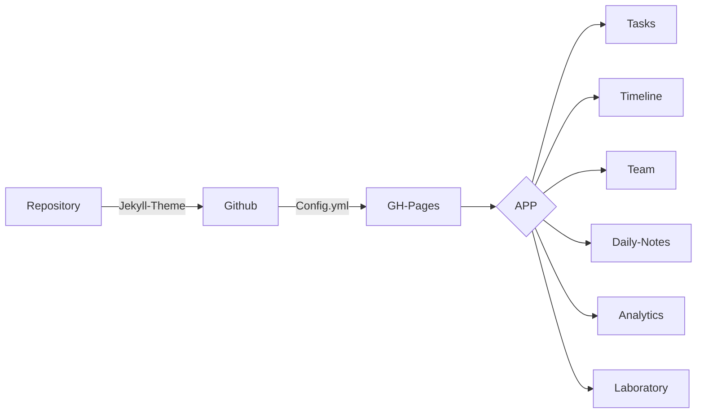

# Sobre o Projeto:
Jekyll Theme + Github, desenvolvimento de uma SPA em Jekyll e hospedando no GitHub Pages.


### COMANDOS

```
1º - Criar Repository
2º - Escolher Tema
3º - Configurar Tema
4º - Publicar pagina 
```


### FLUXOGRAMA/DIAGRAMA



### FONTE:
Themes: http://jekyllthemes.org/
