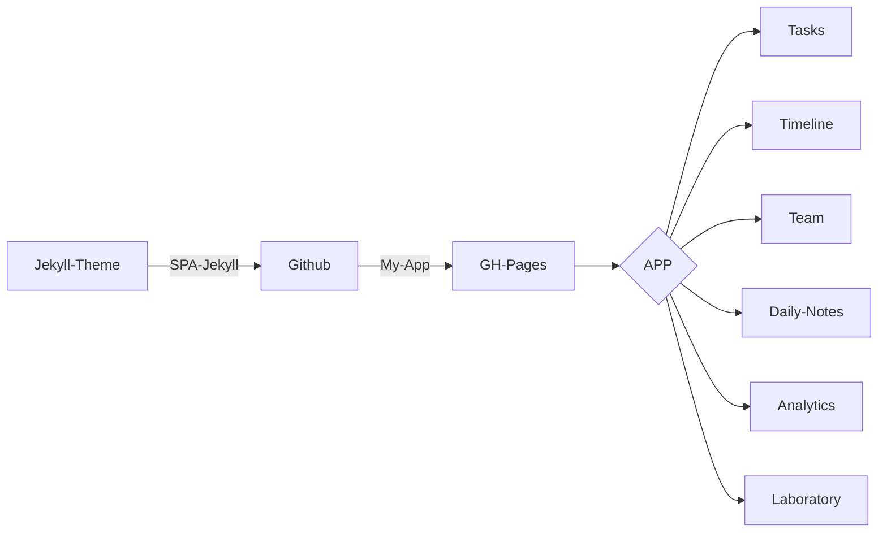

# Sobre o Projeto:
SPA Jekyll + Github, desenvolvimento de uma SPA em Jekyll e hospedando no GitHub Pages.


### COMANDOS

```
1º - Criar Repository
2º - Criar App
3º - Deploy
```


### FLUXOGRAMA/DIAGRAMA



